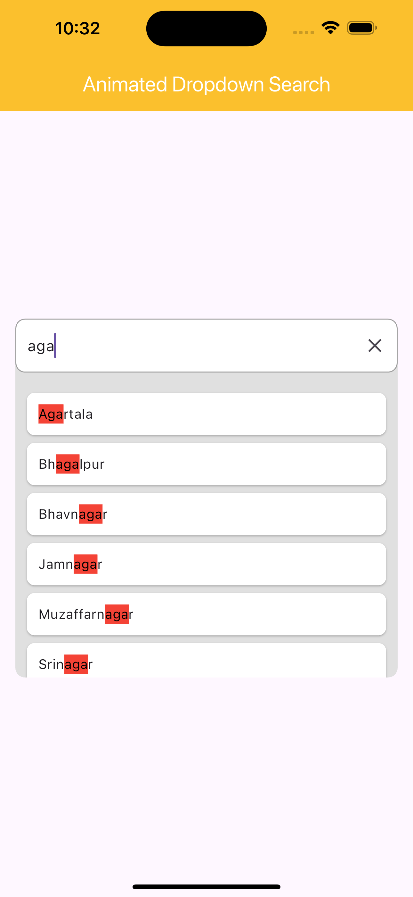
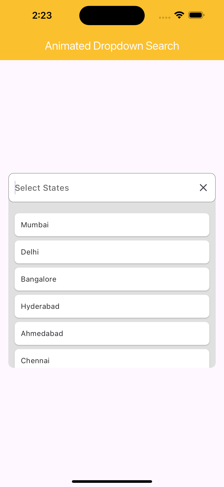
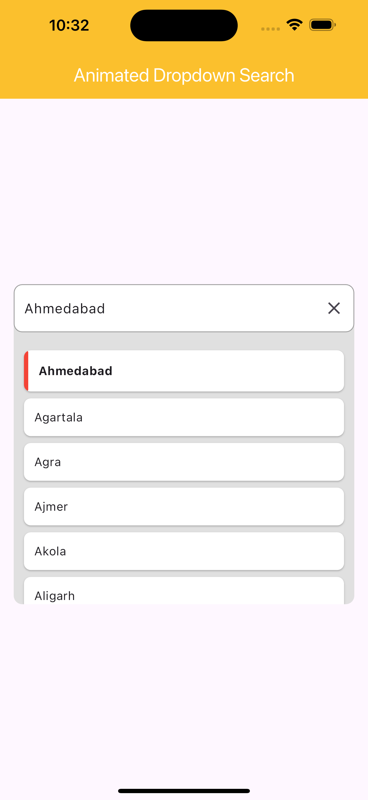
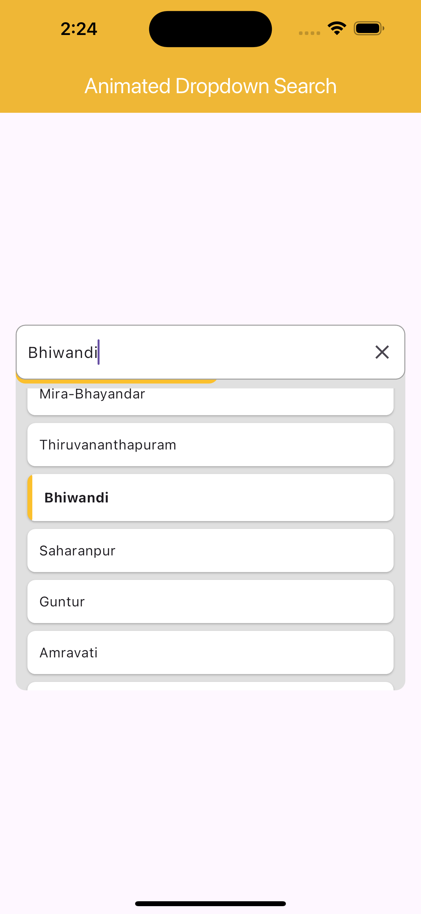

# Animated Dropdown Search

The Animated Dropdown Search package is a customizable Flutter widget that allows users to search and select from a list of options with a smooth animation. This package is perfect for applications that need an elegant and user-friendly dropdown search functionality.

## Features

- Smooth dropdown animation
- Search functionality within the dropdown
- Customizable styles for hint text, option text, borders, and more
- Highlight selected option
- Scroll percentage indicator


## Screenshot


[]

[]

[]

[]


## Installation

Add the following line to your `pubspec.yaml` file:

```yaml
dependencies:
  animated_dropdown_search: ^0.0.2
```

Then run `flutter pub get` to install the package.

## Usage

Here is a simple example of how to use the Animated Dropdown Search widget:

```dart
import 'package:flutter/material.dart';
import 'animated_dropdown_search.dart'; // Import the package

void main() {
  runApp(MyApp());
}

class MyApp extends StatelessWidget {
  @override
  Widget build(BuildContext context) {
    return MaterialApp(
      home: Scaffold(
        appBar: AppBar(title: Text('Animated Dropdown Search Example')),
        body: Center(
          child: Padding(
            padding: const EdgeInsets.all(16.0),
            child: AnimatedDropdownSearch(
              data: ['Apple', 'Banana', 'Cherry', 'Date', 'Elderberry', 'Fig', 'Grapes'],
              hint: 'Select a fruit',
              onSelected: (val) {
                print('Selected: $val');
              },
              enableSearch: true,
              selectedHighlightColor: Colors.yellow,
              scrollPercentageColorIndicator: Colors.red,
            ),
          ),
        ),
      ),
    );
  }
}
```

## Parameters

- `data`: List of strings to display in the dropdown.
- `onSelected`: Callback function when an option is selected. Receives the selected string as a parameter.
- `hint`: Optional hint text to display when no option is selected.
- `hintStyle`: Optional `TextStyle` for the hint text.
- `optionTextStyle`: Optional `TextStyle` for the option text.
- `selectedHighlightColor`: Optional color to highlight the selected option.
- `enableSearch`: Optional boolean to enable or disable the search functionality. Default is `true`.
- `maxHeightForOptions`: Optional maximum height for the options dropdown. Default is 40% of the screen height.
- `scrollPercentageColorIndicator`: Optional color for the scroll percentage indicator.
- `border`: Optional `InputBorder` for the search field.

## Example

Here is another example with more customization options:

```dart
import 'package:flutter/material.dart';
import 'animated_dropdown_search.dart'; // Import the package

void main() {
  runApp(MyApp());
}

class MyApp extends StatelessWidget {
  @override
  Widget build(BuildContext context) {
    return MaterialApp(
      home: Scaffold(
        appBar: AppBar(title: Text('Animated Dropdown Search Example')),
        body: Center(
          child: Padding(
            padding: const EdgeInsets.all(16.0),
            child: AnimatedDropdownSearch(
              data: ['Apple', 'Banana', 'Cherry', 'Date', 'Elderberry', 'Fig', 'Grapes'],
              hint: 'Select a fruit',
              hintStyle: TextStyle(color: Colors.grey),
              optionTextStyle: TextStyle(color: Colors.blue),
              onSelected: (val) {
                print('Selected: $val');
              },
              enableSearch: true,
              maxHeightForOptions: 200.0,
              selectedHighlightColor: Colors.yellow,
              scrollPercentageColorIndicator: Colors.red,
              border: OutlineInputBorder(
                borderRadius: BorderRadius.circular(10.0),
                borderSide: BorderSide(color: Colors.blue),
              ),
            ),
          ),
        ),
      ),
    );
  }
}
```

## License

This project is licensed under the MIT License - see the [LICENSE](LICENSE) file for details.

